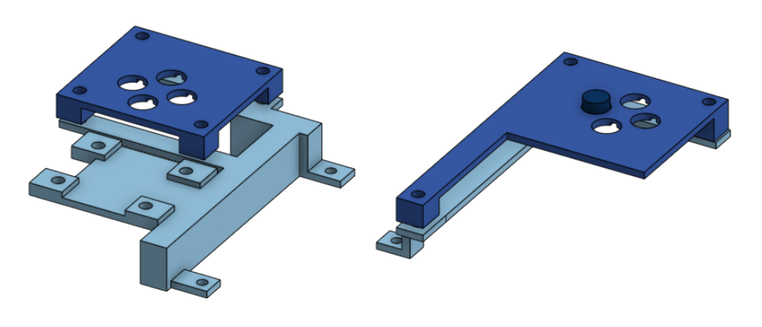

1. TOC
{:toc}

* * *

## The Idea
The main idea of this project is to create a unique handheld device using a Raspberry Pi; which is capable of running all sorts of different games. Making it an ideal single board computer to implement what I want in a handheld gaming console.

I wanted to make something that used all of the skills that were built in the TEJ3MR course including soldering, 3D modeling and circuits. Creating a console creates a difficult yet entertaining project that will further strengthen my skills in engineering.

## Materials
- Raspberry Pi 4B w/ SD card & Heatsink
- Arduino Pro Micro
- Screen (DSI compatible)
- Pi-Sugar Battery Module + 40 Pin GPIO header
- Case/Housing
- Push Buttons
- Thumbsticks
- PerfBoards

## Controls
One of the core aspects of gaming is being able to control your movement in an easy way. In my handheld gaming console, I used a microcontroller (Arduino Pro Micro) to control the gamepad.

Essentially, when you click on a button from the gamepad, it sends a signal to the Arduino which then gives information to the Raspberry Pi to implement whatever is clicked in real life.

## Screen & Power
When creating a console, having a good source of power and having a reliable display can really augment the quality of gaming. So, I decided to create two variations of the console, one portable and one non-portable. Both of these options allows the user to have options when it comes to playability and comfort; depending on their situation.

### Portable
In the portable configuration, the console relies on an in-built screen. To allow for it to be completely portable, the handheld will also have an internal battery that can be charged and allow the user to play anywhere without having to plug the console into an outlet.

### Non-Portable
Unlike the portable configuration, the non-portable setup will not have a built-in display or battery. This is because this configuration is intended to be plugged into a TV/monitor and power source, mostly to play at home. 

Additionally, this configuration will rely on the Raspberry Pi's in-built Bluetooth to allow for pairing with external gamepads and allow multiple people to play together. Alternatively, the option to use the built-in controls will always be available.

## Console Housing

For our design, we initially wanted to design an acrylic case to showcase the internal components to the user to give it a futuristic look. However, we realized that we could not obtain acrylic so we improvised and just made brackets to ensure functionality. These brackets will also allow us to further develop our console in the future to possibly add acrylics.

In the construction of the casing / brackets, I first needed to design the structure so I could 3D print them. So, I used OnShape to create and structure my ideas to ensure the measurements could be exact to 3D print. As I was making the designs, I first wanted to make a casing to surround the entire console. However, I realized how difficult this could be due to the margin of error and lack of 3D print resources. Eventually, I settled on creating smaller brackets to hold the console without using up too many of the resources.

[Onshape of Brackets & Buttons](https://cad.onshape.com/documents/9f5fd6553849816f2f4eccc5/w/470c5e9b79575371b0001919/e/5ac30803e880b7f52b52bd3a?renderMode=0&uiState=678c3ad60a7cb65a2aa72f85)

## Final Assembly
After finishing the 3D printing, I used the brackets made to assemble the screen, battery, Raspberry Pi and controllers together with screws. 

## Conclusion
All in all, creating a handheld console came with its challenges and has ultimately enlightened my curiosity in the finer and more nuianced steps of creating a functional electronic system. Creating the console was the perfect way to cap off a course full of problem solving and critical thinking. 

[Previous Page](./)
