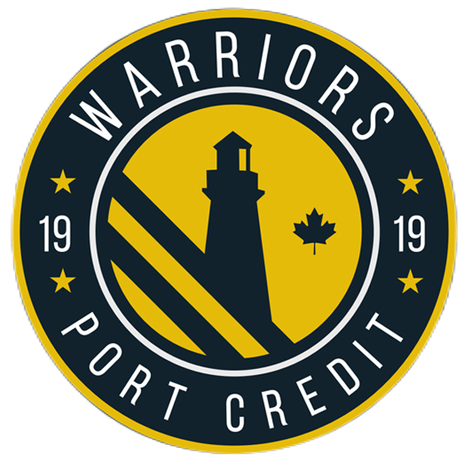

    

    <a href="https://mail.google.com/mail/u/0/?fs=1&to=788513@pdsb.net&tf=cm">Contact Ethan Xiong - 788513@pdsb.net</a>

* * *

1. TOC
{:toc}

* * *

## Projects
#### Handheld Console (_January 2025_)
In the TEJ3MR course, I planned out and created a handheld gaming console for my final project in the course. This project demonstrated my ability to design and construct an electronic device.

[More info](./console.html)

#### Smart Lights System (_November 2024_)

[More info](./smartlights.html)

## About Me
### Who is Ethan Xiong?
Currently, I am a high school student with a passion in engineering and the desire to create innovative designs in my career. 

Since I was young, I loved playing video games. This passion developed into a hobby of learning about computers. Overtime, my knowledge expanded and I realized a career in engineering is what I wanted. Solving problems and critical thinking were valuable skills I learned when I was younger that have transitioned into giving me the experience needed to make steps to become an engineer.

### Education
- Port Credit Secondary School (_September 2022 - Present_)

### Awards & Qualifications
- PCSS Senior Badminton MVP (_2024_)
- Basic First Aid (_2023_)
- Mathematica Newton Contest Honour Roll (_2022_)

### Current Extracurriculars
- Lee's Badminton Elite Team (_2021 - Present_)
- PCSS Badminton Team (_2023 - Present_)
- PCSS Robotics Team (_2024 - Present_)
- PCSS ASA Executive (_2024 - Present_)
- PCSS Curling Team (_2024 - Present_)

### Future Goals

zdjkoahafh